# FitTrack Pro - Diagramas Tecnicos

> Diagramas de arquitectura, flujos y secuencias
> Formato: Mermaid (renderizable en GitHub, VS Code, etc.)

---

## 1. Diagrama C4 - Nivel 1: Contexto

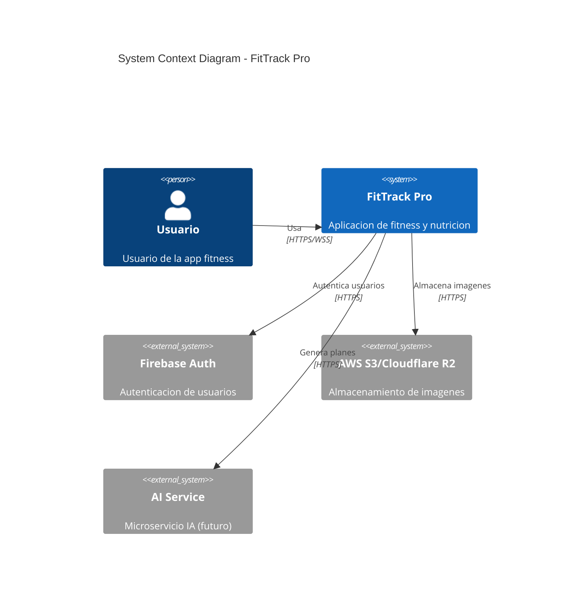
```mermaid
C4Context
    title System Context Diagram - FitTrack Pro

    Person(user, "Usuario", "Usuario de la app fitness")
    
    System(fittrack, "FitTrack Pro", "Aplicacion de fitness y nutricion")
    
    System_Ext(firebase, "Firebase Auth", "Autenticacion de usuarios")
    System_Ext(s3, "AWS S3/Cloudflare R2", "Almacenamiento de imagenes")
    System_Ext(ai, "AI Service", "Microservicio IA (futuro)")
    
    Rel(user, fittrack, "Usa", "HTTPS/WSS")
    Rel(fittrack, firebase, "Autentica usuarios", "HTTPS")
    Rel(fittrack, s3, "Almacena imagenes", "HTTPS")
    Rel(fittrack, ai, "Genera planes", "HTTPS")
```

---

## 2. Diagrama C4 - Nivel 2: Contenedores

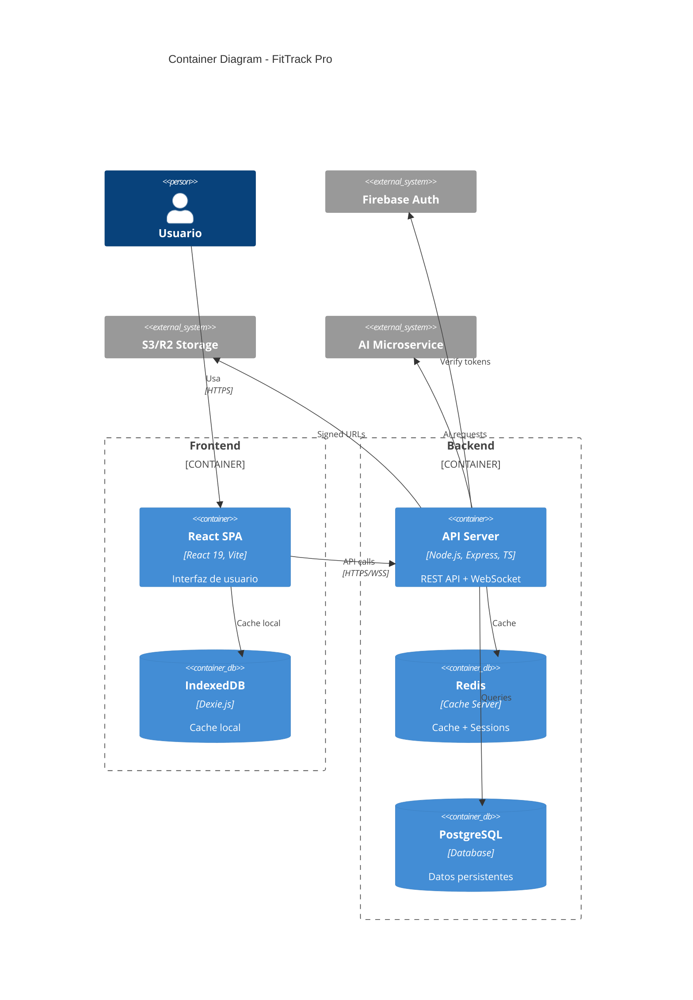
```mermaid
C4Container
    title Container Diagram - FitTrack Pro

    Person(user, "Usuario")

    Container_Boundary(frontend, "Frontend") {
        Container(spa, "React SPA", "React 19, Vite", "Interfaz de usuario")
        ContainerDb(indexeddb, "IndexedDB", "Dexie.js", "Cache local")
    }

    Container_Boundary(backend, "Backend") {
        Container(api, "API Server", "Node.js, Express, TS", "REST API + WebSocket")
        ContainerDb(redis, "Redis", "Cache Server", "Cache + Sessions")
        ContainerDb(postgres, "PostgreSQL", "Database", "Datos persistentes")
    }

    System_Ext(firebase, "Firebase Auth")
    System_Ext(s3, "S3/R2 Storage")
    System_Ext(ai, "AI Microservice")

    Rel(user, spa, "Usa", "HTTPS")
    Rel(spa, api, "API calls", "HTTPS/WSS")
    Rel(spa, indexeddb, "Cache local")
    Rel(api, redis, "Cache")
    Rel(api, postgres, "Queries")
    Rel(api, firebase, "Verify tokens")
    Rel(api, s3, "Signed URLs")
    Rel(api, ai, "AI requests")
```

---

## 3. Diagrama de Componentes - Frontend

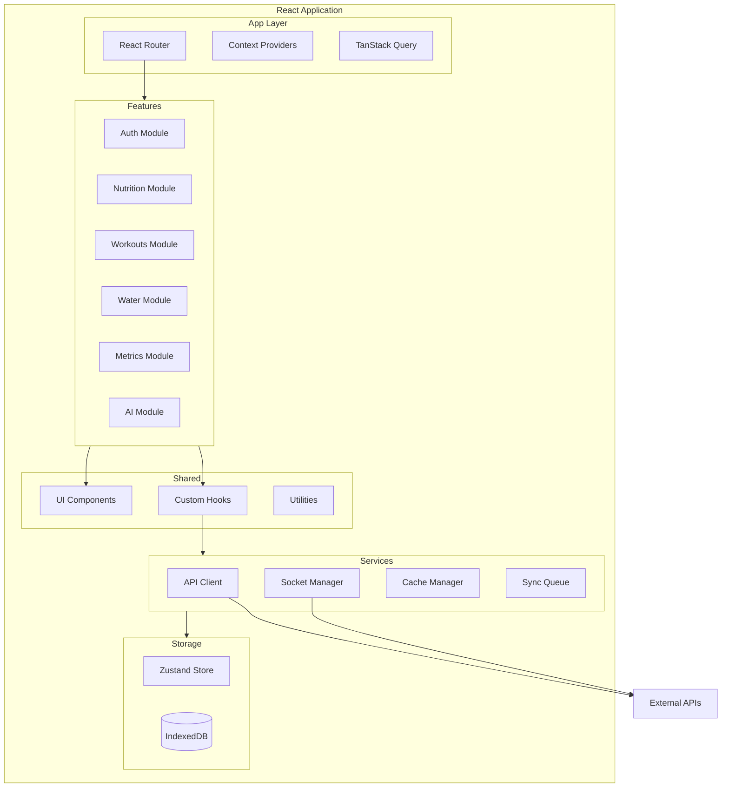
```mermaid
graph TB
    subgraph "React Application"
        subgraph "App Layer"
            Router[React Router]
            Providers[Context Providers]
            QueryClient[TanStack Query]
        end
        
        subgraph "Features"
            Auth[Auth Module]
            Nutrition[Nutrition Module]
            Workouts[Workouts Module]
            Water[Water Module]
            Metrics[Metrics Module]
            AI[AI Module]
        end
        
        subgraph "Shared"
            Components[UI Components]
            Hooks[Custom Hooks]
            Utils[Utilities]
        end
        
        subgraph "Services"
            APIClient[API Client]
            SocketManager[Socket Manager]
            CacheManager[Cache Manager]
            SyncQueue[Sync Queue]
        end
        
        subgraph "Storage"
            Zustand[Zustand Store]
            IndexedDB[(IndexedDB)]
        end
    end
    
    Router --> Features
    Features --> Hooks
    Features --> Components
    Hooks --> Services
    Services --> Storage
    APIClient --> External[External APIs]
    SocketManager --> External
```

---

## 4. Diagrama de Componentes - Backend

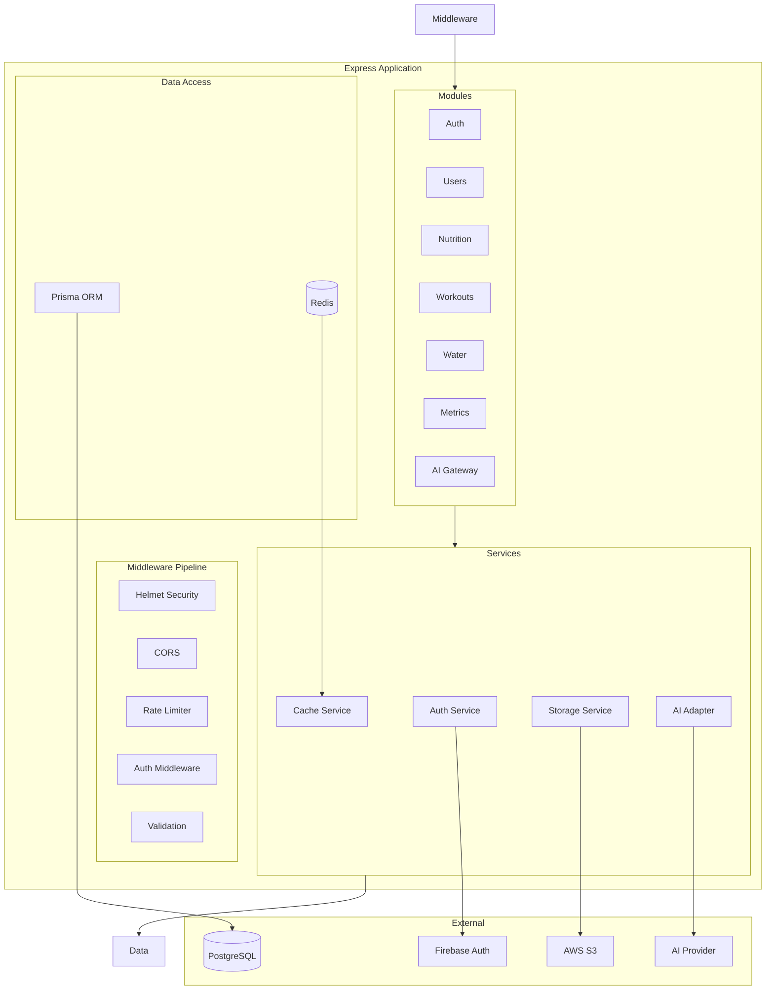
```mermaid
graph TB
    subgraph "Express Application"
        subgraph "Middleware Pipeline"
            Helmet[Helmet Security]
            CORS[CORS]
            RateLimit[Rate Limiter]
            AuthMW[Auth Middleware]
            Validate[Validation]
        end
        
        subgraph "Modules"
            AuthModule[Auth]
            UsersModule[Users]
            NutritionModule[Nutrition]
            WorkoutsModule[Workouts]
            WaterModule[Water]
            MetricsModule[Metrics]
            AIModule[AI Gateway]
        end
        
        subgraph "Services"
            AuthService[Auth Service]
            CacheService[Cache Service]
            StorageService[Storage Service]
            AIService[AI Adapter]
        end
        
        subgraph "Data Access"
            Prisma[Prisma ORM]
            Redis[(Redis)]
            
        end
    end
    
    subgraph "External"
        PostgreSQL[(PostgreSQL)]
        Firebase[Firebase Auth]
        S3[AWS S3]
        AIProvider[AI Provider]
    end
    
    Middleware --> Modules
    Modules --> Services
    Services --> Data
    Prisma --> PostgreSQL
    Redis --> CacheService
    StorageService --> S3
    AIService --> AIProvider
    AuthService --> Firebase
```

---

## 5. Flujo de Autenticacion

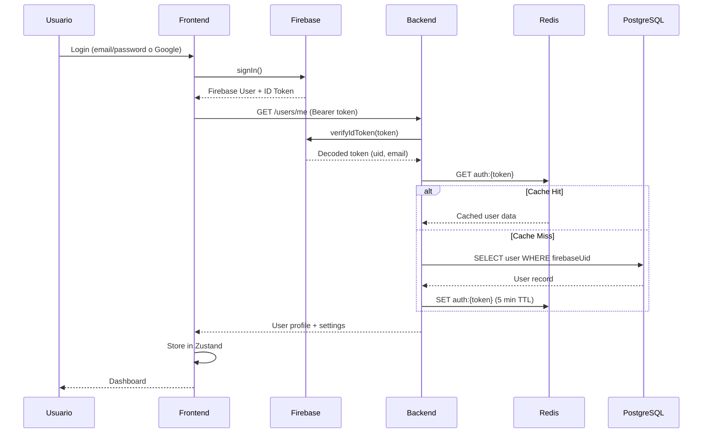
```mermaid
sequenceDiagram
    participant U as Usuario
    participant F as Frontend
    participant FB as Firebase
    participant B as Backend
    participant R as Redis
    participant DB as PostgreSQL
    
    U->>F: Login (email/password o Google)
    F->>FB: signIn()
    FB-->>F: Firebase User + ID Token
    
    F->>B: GET /users/me (Bearer token)
    B->>FB: verifyIdToken(token)
    FB-->>B: Decoded token (uid, email)
    
    B->>R: GET auth:{token}
    alt Cache Hit
        R-->>B: Cached user data
    else Cache Miss
        B->>DB: SELECT user WHERE firebaseUid
        DB-->>B: User record
        B->>R: SET auth:{token} (5 min TTL)
    end
    
    B-->>F: User profile + settings
    F->>F: Store in Zustand
    F-->>U: Dashboard
```

---

## 6. Flujo de Registro de Comida

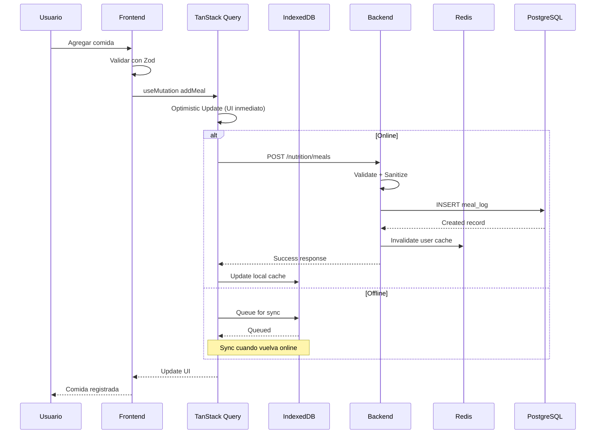
```mermaid
sequenceDiagram
    participant U as Usuario
    participant F as Frontend
    participant TQ as TanStack Query
    participant IDB as IndexedDB
    participant B as Backend
    participant R as Redis
    participant DB as PostgreSQL
    
    U->>F: Agregar comida
    F->>F: Validar con Zod
    
    F->>TQ: useMutation addMeal
    TQ->>TQ: Optimistic Update (UI inmediato)
    
    alt Online
        TQ->>B: POST /nutrition/meals
        B->>B: Validate + Sanitize
        B->>DB: INSERT meal_log
        DB-->>B: Created record
        B->>R: Invalidate user cache
        B-->>TQ: Success response
        TQ->>IDB: Update local cache
    else Offline
        TQ->>IDB: Queue for sync
        IDB-->>TQ: Queued
        Note over TQ,IDB: Sync cuando vuelva online
    end
    
    TQ-->>F: Update UI
    F-->>U: Comida registrada
```

---

## 7. Flujo de Sesion de Entrenamiento

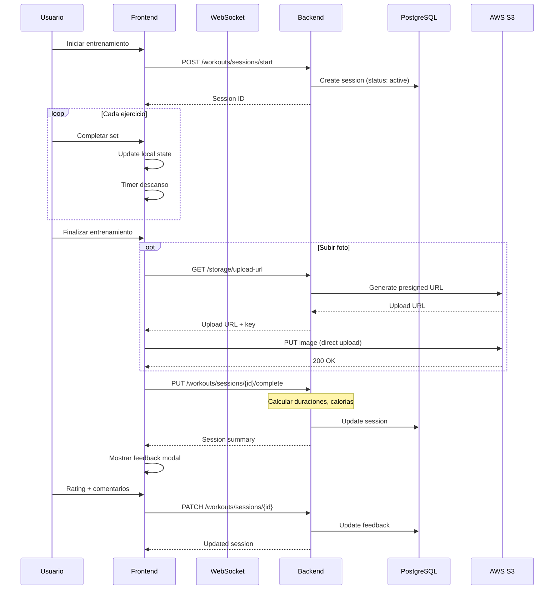
```mermaid
sequenceDiagram
    participant U as Usuario
    participant F as Frontend
    participant WS as WebSocket
    participant B as Backend
    participant DB as PostgreSQL
    participant S3 as AWS S3
    
    U->>F: Iniciar entrenamiento
    F->>B: POST /workouts/sessions/start
    B->>DB: Create session (status: active)
    B-->>F: Session ID
    
    loop Cada ejercicio
        U->>F: Completar set
        F->>F: Update local state
        F->>F: Timer descanso
    end
    
    U->>F: Finalizar entrenamiento
    
    opt Subir foto
        F->>B: GET /storage/upload-url
        B->>S3: Generate presigned URL
        S3-->>B: Upload URL
        B-->>F: Upload URL + key
        F->>S3: PUT image (direct upload)
        S3-->>F: 200 OK
    end
    
    F->>B: PUT /workouts/sessions/{id}/complete
    Note over B: Calcular duraciones, calorias
    B->>DB: Update session
    B-->>F: Session summary
    
    F->>F: Mostrar feedback modal
    U->>F: Rating + comentarios
    F->>B: PATCH /workouts/sessions/{id}
    B->>DB: Update feedback
    B-->>F: Updated session
```

---

## 8. Flujo de Recordatorio de Agua (WebSocket)

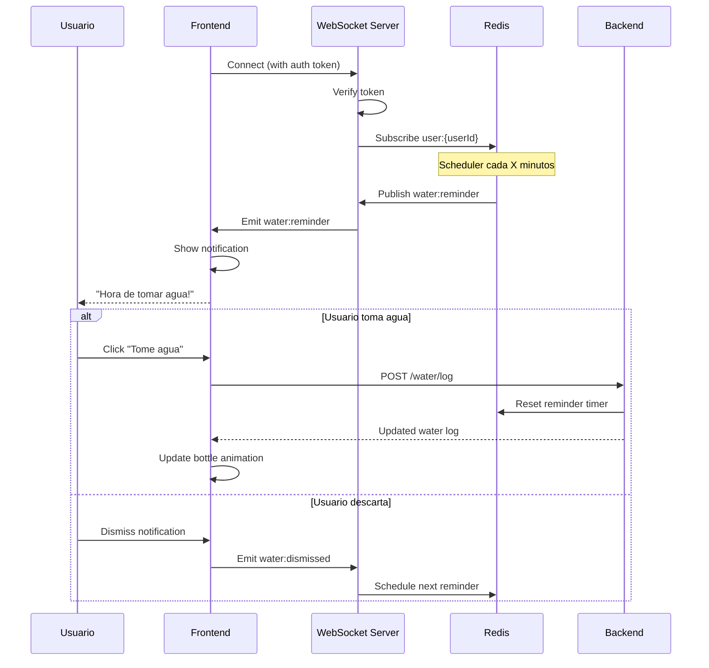
```mermaid
sequenceDiagram
    participant U as Usuario
    participant F as Frontend
    participant WS as WebSocket Server
    participant R as Redis
    participant B as Backend
    
    F->>WS: Connect (with auth token)
    WS->>WS: Verify token
    WS->>R: Subscribe user:{userId}
    
    Note over R: Scheduler cada X minutos
    
    R->>WS: Publish water:reminder
    WS->>F: Emit water:reminder
    F->>F: Show notification
    F-->>U: "Hora de tomar agua!"
    
    alt Usuario toma agua
        U->>F: Click "Tome agua"
        F->>B: POST /water/log
        B->>R: Reset reminder timer
        B-->>F: Updated water log
        F->>F: Update bottle animation
    else Usuario descarta
        U->>F: Dismiss notification
        F->>WS: Emit water:dismissed
        WS->>R: Schedule next reminder
    end
```

---

## 9. Flujo de Integracion IA (Futuro)

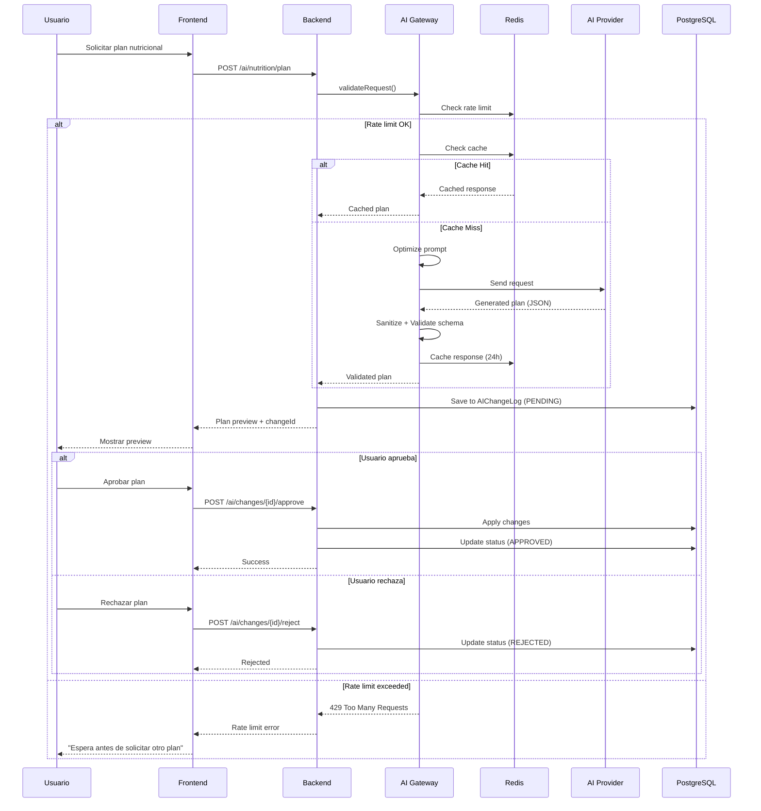
```mermaid
sequenceDiagram
    participant U as Usuario
    participant F as Frontend
    participant B as Backend
    participant AG as AI Gateway
    participant R as Redis
    participant AI as AI Provider
    participant DB as PostgreSQL
    
    U->>F: Solicitar plan nutricional
    F->>B: POST /ai/nutrition/plan
    
    B->>AG: validateRequest()
    AG->>R: Check rate limit
    
    alt Rate limit OK
        AG->>R: Check cache
        alt Cache Hit
            R-->>AG: Cached response
            AG-->>B: Cached plan
        else Cache Miss
            AG->>AG: Optimize prompt
            AG->>AI: Send request
            AI-->>AG: Generated plan (JSON)
            AG->>AG: Sanitize + Validate schema
            AG->>R: Cache response (24h)
            AG-->>B: Validated plan
        end
        
        B->>DB: Save to AIChangeLog (PENDING)
        B-->>F: Plan preview + changeId
        F-->>U: Mostrar preview
        
        alt Usuario aprueba
            U->>F: Aprobar plan
            F->>B: POST /ai/changes/{id}/approve
            B->>DB: Apply changes
            B->>DB: Update status (APPROVED)
            B-->>F: Success
        else Usuario rechaza
            U->>F: Rechazar plan
            F->>B: POST /ai/changes/{id}/reject
            B->>DB: Update status (REJECTED)
            B-->>F: Rejected
        end
    else Rate limit exceeded
        AG-->>B: 429 Too Many Requests
        B-->>F: Rate limit error
        F-->>U: "Espera antes de solicitar otro plan"
    end
```

---

## 10. Diagrama de Estados - Sesion de Entrenamiento

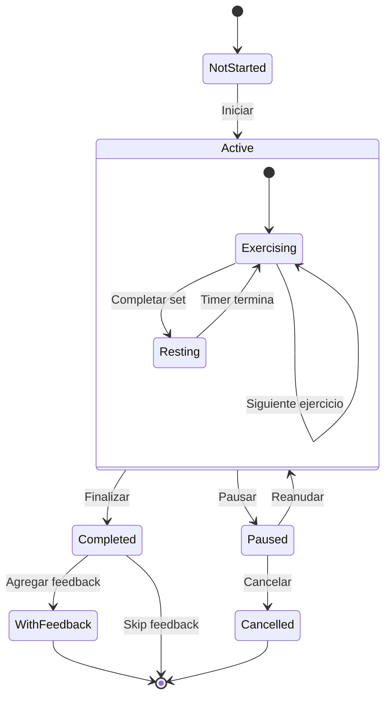
```mermaid
stateDiagram-v2
    [*] --> NotStarted
    
    NotStarted --> Active: Iniciar
    
    state Active {
        [*] --> Exercising
        Exercising --> Resting: Completar set
        Resting --> Exercising: Timer termina
        Exercising --> Exercising: Siguiente ejercicio
    }
    
    Active --> Paused: Pausar
    Paused --> Active: Reanudar
    Paused --> Cancelled: Cancelar
    
    Active --> Completed: Finalizar
    
    Completed --> WithFeedback: Agregar feedback
    WithFeedback --> [*]
    Completed --> [*]: Skip feedback
    
    Cancelled --> [*]
```

---

## 11. Diagrama de Estados - Plan de IA

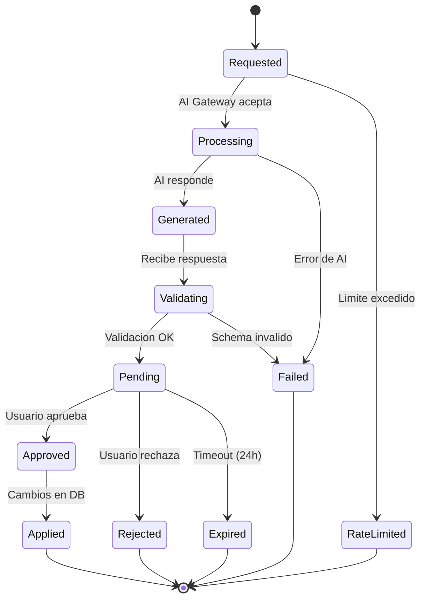
```mermaid
stateDiagram-v2
    [*] --> Requested
    
    Requested --> Processing: AI Gateway acepta
    Requested --> RateLimited: Limite excedido
    
    Processing --> Generated: AI responde
    Processing --> Failed: Error de AI
    
    Generated --> Validating: Recibe respuesta
    Validating --> Pending: Validacion OK
    Validating --> Failed: Schema invalido
    
    Pending --> Approved: Usuario aprueba
    Pending --> Rejected: Usuario rechaza
    Pending --> Expired: Timeout (24h)
    
    Approved --> Applied: Cambios en DB
    Applied --> [*]
    
    Rejected --> [*]
    Expired --> [*]
    Failed --> [*]
    RateLimited --> [*]
```

---

## 12. Modelo de Datos Simplificado

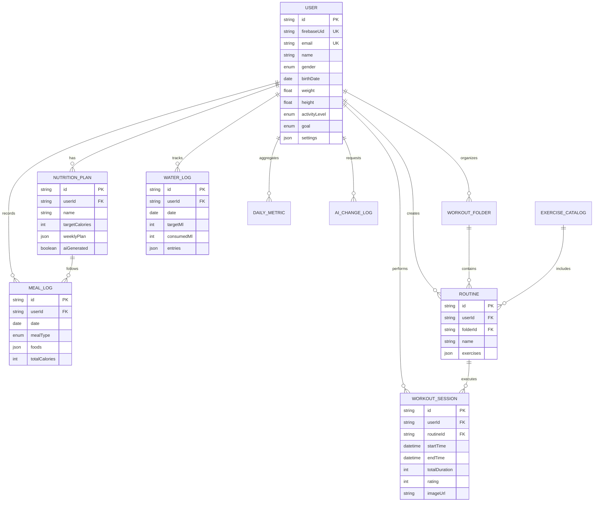
```mermaid
erDiagram
    USER ||--o{ NUTRITION_PLAN : has
    USER ||--o{ MEAL_LOG : records
    USER ||--o{ WORKOUT_FOLDER : organizes
    USER ||--o{ ROUTINE : creates
    USER ||--o{ WORKOUT_SESSION : performs
    USER ||--o{ WATER_LOG : tracks
    USER ||--o{ DAILY_METRIC : aggregates
    USER ||--o{ AI_CHANGE_LOG : requests
    
    WORKOUT_FOLDER ||--o{ ROUTINE : contains
    ROUTINE ||--o{ WORKOUT_SESSION : executes
    NUTRITION_PLAN ||--o{ MEAL_LOG : follows
    
    EXERCISE_CATALOG ||--o{ ROUTINE : includes
    
    USER {
        string id PK
        string firebaseUid UK
        string email UK
        string name
        enum gender
        date birthDate
        float weight
        float height
        enum activityLevel
        enum goal
        json settings
    }
    
    NUTRITION_PLAN {
        string id PK
        string userId FK
        string name
        int targetCalories
        json weeklyPlan
        boolean aiGenerated
    }
    
    MEAL_LOG {
        string id PK
        string userId FK
        date date
        enum mealType
        json foods
        int totalCalories
    }
    
    ROUTINE {
        string id PK
        string userId FK
        string folderId FK
        string name
        json exercises
    }
    
    WORKOUT_SESSION {
        string id PK
        string userId FK
        string routineId FK
        datetime startTime
        datetime endTime
        int totalDuration
        int rating
        string imageUrl
    }
    
    WATER_LOG {
        string id PK
        string userId FK
        date date
        int targetMl
        int consumedMl
        json entries
    }
```

---

## 13. Arquitectura de Cache Multinivel

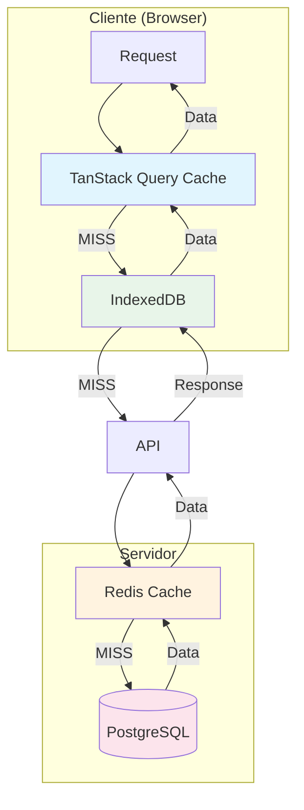
```mermaid
flowchart TB
    subgraph Client["Cliente (Browser)"]
        Request[Request]
        L1[TanStack Query Cache]
        L2[IndexedDB]
    end
    
    subgraph Server["Servidor"]
        L3[Redis Cache]
        L4[(PostgreSQL)]
    end
    
    Request --> L1
    L1 -->|MISS| L2
    L2 -->|MISS| API
    API --> L3
    L3 -->|MISS| L4
    
    L4 -->|Data| L3
    L3 -->|Data| API
    API -->|Response| L2
    L2 -->|Data| L1
    L1 -->|Data| Request
    
    style L1 fill:#e1f5fe
    style L2 fill:#e8f5e9
    style L3 fill:#fff3e0
    style L4 fill:#fce4ec
```

---

## 14. Flujo de Carga de Imagen

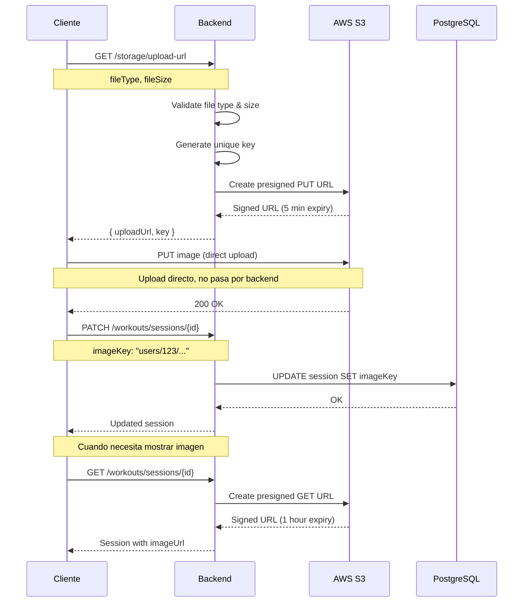
```mermaid
sequenceDiagram
    participant C as Cliente
    participant B as Backend
    participant S3 as AWS S3
    participant DB as PostgreSQL
    
    C->>B: GET /storage/upload-url
    Note over C,B: fileType, fileSize
    
    B->>B: Validate file type & size
    B->>B: Generate unique key
    B->>S3: Create presigned PUT URL
    S3-->>B: Signed URL (5 min expiry)
    B-->>C: { uploadUrl, key }
    
    C->>S3: PUT image (direct upload)
    Note over C,S3: Upload directo, no pasa por backend
    S3-->>C: 200 OK
    
    C->>B: PATCH /workouts/sessions/{id}
    Note over C,B: imageKey: "users/123/..."
    B->>DB: UPDATE session SET imageKey
    DB-->>B: OK
    B-->>C: Updated session
    
    Note over C,B: Cuando necesita mostrar imagen
    C->>B: GET /workouts/sessions/{id}
    B->>S3: Create presigned GET URL
    S3-->>B: Signed URL (1 hour expiry)
    B-->>C: Session with imageUrl
```

---

## 15. Deployment Architecture

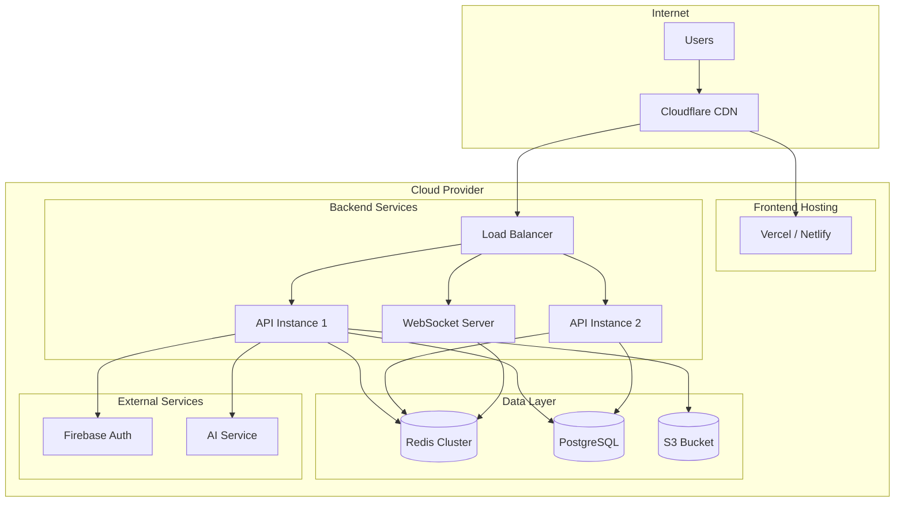
```mermaid
graph TB
    subgraph Internet
        Users[Users]
        CDN[Cloudflare CDN]
    end
    
    subgraph Cloud["Cloud Provider"]
        subgraph Frontend["Frontend Hosting"]
            Vercel[Vercel / Netlify]
        end
        
        subgraph Backend["Backend Services"]
            LB[Load Balancer]
            API1[API Instance 1]
            API2[API Instance 2]
            WS[WebSocket Server]
        end
        
        subgraph Data["Data Layer"]
            Redis[(Redis Cluster)]
            PG[(PostgreSQL)]
            S3[(S3 Bucket)]
        end
        
        subgraph External["External Services"]
            Firebase[Firebase Auth]
            AI[AI Service]
        end
    end
    
    Users --> CDN
    CDN --> Vercel
    CDN --> LB
    
    LB --> API1
    LB --> API2
    LB --> WS
    
    API1 --> Redis
    API2 --> Redis
    API1 --> PG
    API2 --> PG
    API1 --> S3
    WS --> Redis
    
    API1 --> Firebase
    API1 --> AI
```

---

## 16. Leyenda de Iconos

| Icono | Significado |
|-------|-------------|
| `[*]` | Estado inicial/final |
| `-->` | Flujo de datos |
| `-->>` | Respuesta asincrona |
| `||--o{` | Relacion uno a muchos |
| `PK` | Primary Key |
| `FK` | Foreign Key |
| `UK` | Unique Key |
